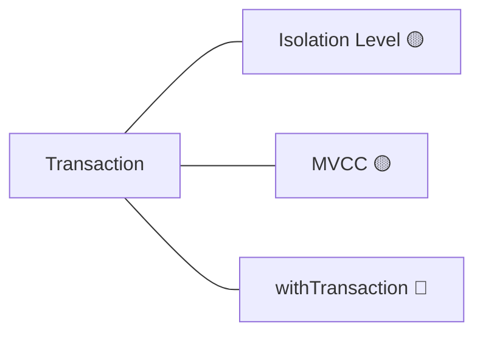

# Mermaid Maker — 지식 그래프 뷰 최신화

우리 메모리의 `knowledge-graph.md`(source of truth)를 읽어, config.md의 **지식 그래프 파일**(`Code tutor graph.md`)에 **mermaid 그래프로 렌더**해 최신 상태로 유지한다. Obsidian이 이 파일을 열면 그래프가 시각적으로 보인다.

**활성 조건**: config.md에 그래프 파일 경로가 설정돼 있을 때.

## 트리거

- 명시: "그래프 최신화", "지식 그래프 업데이트"
- 자동: `/code-tutor end`에서, 또는 knowledge-graph에 노드·엣지가 여러 개 추가된 뒤.
- 터미널 내 즉시 확인("지식 그래프 보여줘")은 modes.md의 mermaid 렌더로 처리 — 이건 **파일 최신화**가 목적.

## 절차

1. `~/.claude/memory/code-tutor/knowledge-graph.md`를 읽는다 (노드 = `## 노드`, 엣지 = `- [[대상]] — 근거`).
2. `~/.claude/memory/code-tutor/learning-state.md`를 읽어 각 노드의 이해도 이모지를 붙인다.
3. 아래 형식으로 그래프 파일 전체를 재작성한다 (덮어쓰기 — 이 파일은 파생 뷰다).

```markdown
---
generated_by: code-tutor mermaid-maker
updated: 2026-08-17
---

# Code Tutor — 지식 그래프

> knowledge-graph.md(메모리)에서 자동 생성. 직접 편집 금지 — 다음 최신화 때 덮어씀.



## 주제별 진척
- #Transaction — 7개 중 🟡 3, 🟢 1, 🔵 1
- #React — …
```

## 렌더 규칙

- 엣지는 무방향 `---`. knowledge-graph의 엣지를 한 번씩만.
- 노드 라벨에 learning-state 이모지. 이해도 없으면 이모지 생략.
- 근거(`— …`)가 있으면 엣지 라벨로: `A ---|근거| B` (짧을 때만, 그래프가 지저분해지면 생략).
- 노드가 많으면(30+) 주제(#태그)별로 `subgraph`로 묶는다.
- **파생 뷰이므로 전체 덮어쓰기.** 사용자가 이 파일을 직접 편집하지 않는다는 전제(상단 경고 명시).
- "주제별 진척" 섹션은 learning-state의 `#태그` 집계로 함께 갱신.

## 향후

가중치 속성이 knowledge-graph에 추가되면, mermaid 엣지 두께/스타일이나 노드 크기로 매핑한다. HTML 렌더가 필요하면 같은 그래프 데이터를 별도 스킬로 렌더(이 파일은 mermaid 전용).
