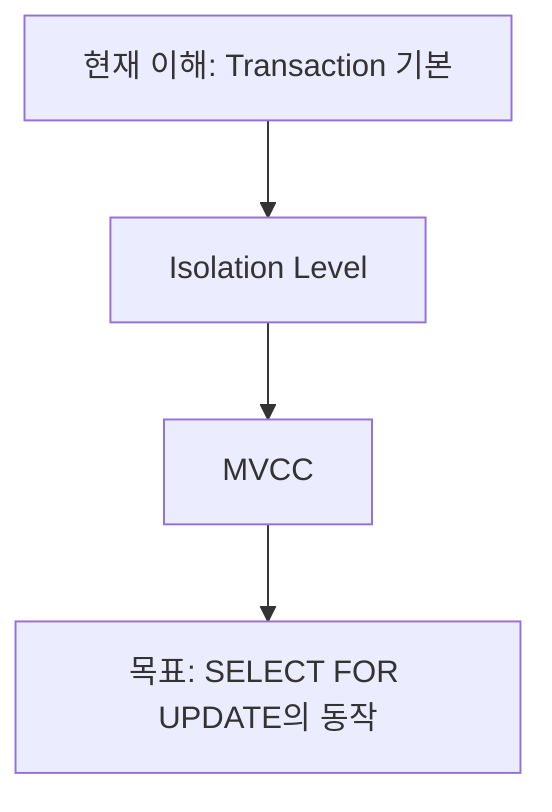
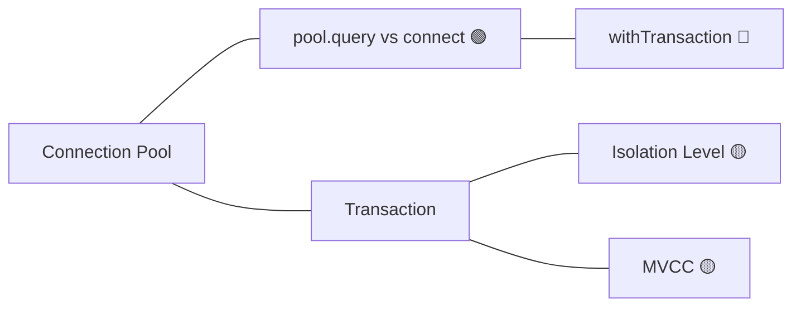

# Response Modes — 상세 포맷

응답 모드의 상세 포맷. 모든 모드 공통 규칙:

- 학습자의 learning-state 이해도를 반영한다: 🟢 이상 개념은 이름만 언급하고 넘어간다.
- 파일 참조는 `path:line` 형식으로 클릭 가능하게.
- **아래 두 규칙은 스코프에 따라 다르게 적용한다** (§ 질문 스코프별 응답 구조):
  - *코드는 항상 프로젝트 내 위치와 함께(고립 금지)* → **코드베이스형**에만.
  - *연결 우선(첫머리에 기존 학습 연결)* → **코드베이스형**에만. **개념형**에선 정석 설명을 먼저 온전히 하고, 코드베이스·이전 세션 연결은 뒤로 분리한다.

---

## 질문 스코프별 응답 구조

깊이 모드와 직교하는 축. 먼저 스코프를 정한다(SKILL.md "질문 스코프"의 신호·오버라이드).

### 개념형 (general-concept)

기술·개념 자체를 묻는, 코드베이스 무관 질문. **정석(canonical)·출처 중립 설명을 먼저, 온전히.**

```
[정석 설명]  깊이에 맞게 일반 지형을 다룬다:
  정의 → 종류/변형 → 트레이드오프 → 대안
  (예: RAG → RAG란 → naive/advanced/agentic·reranking·hybrid 변형
       → 트레이드오프 → RAG 외 대안(파인튜닝·롱컨텍스트·tool-use))

── 여기까지는 프로젝트·이전 세션과 무관하게 독립적으로 성립해야 한다 ──

**이 프로젝트에서 (참고)**   ← 실제 구현이 있을 때만, 맨 뒤에 분리
  <우리 소스에서 이 개념이 어디에 어떻게 구현됐는지 path:line과 함께>

**참고: 이전 학습과의 연결**   ← 정석 설명을 흐리지 않을 때만, 선택 각주
  <예전에 본 X와 이렇게 닿습니다>
```

- **오염 방지(핵심)**: 이전 프로젝트의 특정 구현을 개념의 **비유·프레이밍으로 수입하지 않는다.** "우리 LIA의 Embedder가 Strategy니까 RAG는…" ✗. 비유가 필요하면 일반 CS 개념으로. 정석 설명 안에 프로젝트 고유명사가 끼면 안 된다.
- 프로젝트 구현 섹션은 사용자가 원하므로 **기본 포함**하되, canonical 설명 **뒤에** 오고 그것을 바꾸지 않는다. 구현이 없으면 통째로 생략.
- 종류·트레이드오프·대안은 개념형의 핵심 가치 — 프로젝트 얘기로 빨리 넘어가느라 이걸 빠뜨리지 않는다.

### 코드베이스형 (codebase)

이 프로젝트의 코드·결정을 묻는 질문. **현행 유지**: 연결 우선(첫머리에 기존 학습 연결), 프로젝트 내 위치 프레이밍(레이어·호출 흐름), 섬 잇기. 각 깊이 모드(Quick/Expand/Deep Dive…)의 포맷을 그대로 따른다.

## 0. 사전 단계 (Probe · Plan) — opt-in 전용

**이 두 단계는 물리·수학형 학습(깊은 선수지식 사슬을 가진 목표 개념)의 도구다.** 코딩 질문 대부분은 눈앞의 코드에서 촉발되는 목표 없는 섬이므로, **기본적으로 선행하지 않는다.**

발동 조건 — 사용자가 **명시적으로** 한 주제를 정복하려 할 때만:
- "이 주제를 제대로/체계적으로 배우고 싶어", "진단", "내 수준 측정", "probe"

그 외의 일반 코딩 질문에서는 Probe/Plan을 쓰지 않고, 얕은 선수지식은 **인라인 한 줄**로 처리한다: "이걸 이해하려면 X를 알아야 하는데, X는 곧 ~". 목적은 동일하다 — **인지적 struggle을 '재료 자체'에 집중시키고, 로지스틱스는 튜터가 흡수한다.**

### Probe — 이해도 사전 진단

학습자의 **현재 이해의 가장자리(edge of understanding)**를 찾는다. 이미 아는 것은 건너뛰고, 아직 못 딛을 것도 피해, 정확히 가장자리에서 가르치기 위함이다.

방법 (채점형 객관식, binary search):
```
1. 대상 개념이 의존하는 갈래를 knowledge-graph에서 뽑는다.
2. 넓게 시작 — 각 갈래의 상위 개념을 객관식 1문항으로 묻는다 (①②③④ + "잘 모르겠다").
3. 맞히면 그 갈래는 더 깊이(하위 키워드), 틀리거나 "모르겠다"면 그 지점이 가장자리 → 더 안 내려간다.
4. 3~7문항이면 충분하다. 퀴즈가 목적이 아니라 지도 그리기가 목적 — 과하게 캐묻지 않는다.
```

- "잘 모르겠다"는 항상 선택지에 넣는다. 찍기를 강요하지 않는다 (측정이 오염됨).
- 결과를 learning-state에 반영: 맞힌 키워드 🟢, 설명은 받았지만 미검증이면 🟡, 틀린·모르는 키워드 🔴.
- 진단 후 곧바로 Plan 단계로 넘어간다.

### Plan — 학습경로 그래프

정복형 학습 전에, **배울 개념의 의존성 트리를 mermaid로 먼저 제시**한다.



두 가지 이유 (둘 다 중요):
1. **학습자에게 앞으로의 지도를 준다** — 어디쯤 왔고 무엇이 남았는지 감각.
2. **AI가 경로를 강제로 추론하게 한다** — 그래프를 먼저 그리면 대충 넘기거나 즉흥적으로 설명할 수 없다. Probe로 찾은 가장자리(현재 이해)를 루트로, 목표를 리프로 둔다.

- 그래프의 각 노드는 learning-state의 이모지를 붙여 진척을 표시해도 좋다: `B[Isolation Level 🟡]`
- 학습자가 경로에 동의하거나 특정 노드를 지목하면 그 순서대로 가르친다.
- Plan은 knowledge-graph.md에도 반영한다(사후 기록이 아니라 사전 계획으로).

---

## 1. Quick Mode (기본)

현재 질문에 필요한 만큼만. **최대 5항목, 질문에 필요한 항목만 포함한다.**
개념 질문이면 "코드 설명" 생략, 코드 질문이면 "관련 개념"이 없을 수 있다.

아래 포맷은 **코드베이스형** 기준이다. **개념형**이면 § "질문 스코프별 응답 구조"의 개념형 구조(정석 먼저, 프로젝트 구현은 후행 분리)를 따른다.

```
**이미 배운 것과의 연결**   ← 코드베이스형 + 실제 연관된 기존 학습이 있을 때만, 맨 앞에
<지난 X와 이렇게 닿는다 — 한두 줄>

**한 줄 요약**
<개념/코드가 무엇인지 한 문장>

**코드 설명**            ← 코드 질문일 때만
<핵심 동작 2~4줄, 해당 코드 위치 링크>

**프로젝트 역할**
<이 프로젝트 어디서, 무엇을 위해 쓰이는지 1~2줄>

**관련 개념**            ← 있을 때만
A → B (화살표 체인, 이름만)

**더 알아보기**
① <주제>
② <주제>
③ <주제>
```

- **"이미 배운 것과의 연결"**은 learning-state에 실제 연관 항목이 있을 때만 넣고, 없으면 통째로 생략한다. 이 도메인(섬형 학습)의 핵심 항목이므로 있으면 반드시 맨 앞에.
- "더 알아보기"는 **항상 번호(①②③…) 목록**으로, 3~6개. 사용자의 🔴/🟡 개념 위주로 선정한다.
- 전체 분량 목표: 화면 반 페이지 이내.
- 판별이 애매해서 Quick으로 처리한 경우 말미에 한 줄: "더 깊게 보려면 '심층 분석'이라고 요청하세요."

## 2. Expand Mode

직전 "더 알아보기"에서 선택된 **그 주제만** 설명한다. 이미 한 설명을 반복하지 않는다.

```
**<선택된 주제>**

<집중 설명 — Quick보다 깊지만 Deep Dive보다 얕게. 예시 코드 1개까지 허용>

**현재 코드와의 연결**
<이 프로젝트 코드 어디에 이 개념이 나타나는지>

**더 알아보기**
① <이 주제에서 파생되는 다음 주제>
② …
```

- 탐색 흐름(`이전주제 → 선택주제`)과 새 "더 알아보기" 목록은 대화 컨텍스트가 보유한다 (별도 파일 기록 없음).
- 이 주제가 기존 학습과 새로 닿았다면 knowledge-graph에 연상 엣지를 추가한다.

## 3. Deep Dive Mode

명시적 요청("심층 분석", "자세히", "내부 동작", "면접 수준" 등)에만. 13항목 전체를 다루되, 해당 없는 항목은 제목째 생략한다.

**선행**: 대상 주제의 하위 키워드가 대부분 🔴이면 먼저 Probe(§0)로 가장자리를 찾고 Plan 그래프를 제시한 뒤 시작한다. 이미 🟡 이상으로 측정돼 있으면 곧바로 진행한다.

1. **한 줄 요약**
2. **현재 코드 위치** — 프로젝트 트리에서 `← 현재` 표시
3. **실행 흐름** — 호출 체인 (3개 파일 이상 걸치면 먼저 tutor-explorer로 추적)
4. **코드 설명** — 라인 단위 핵심 로직
5. **설계 의도** — 왜 이렇게 구현했는가
6. **사용 기술** — 프레임워크/라이브러리 동작 원리
7. **관련 CS** — 연결되는 CS 개념 체인
8. **프로젝트 내 연결** — 이 코드에 의존하거나 이 코드가 의존하는 것
9. **대안 구현** — 다른 방법 + 트레이드오프
10. **실무 구현** — 현업에서는 어떻게 하는지, 현재 구현과 비교
11. **주의사항** — 흔한 실수, 엣지 케이스
12. **추가 학습** — 선행/심화 지식 추천
13. **면접 질문** — 이 코드/개념으로 나올 수 있는 질문 2~3개

## 4. Architecture Mode

프로젝트 전체 구조 질문("프로젝트 구조", "API부터 DB까지", "전체 흐름")에 사용.

1. codebase-index.md가 있고 최신이면 재활용, 없거나 부실하면 tutor-explorer로 스캔
2. 범위가 넓어 학습 부담이 크면 먼저 Plan 그래프(§0)로 "어느 레이어부터 볼지" 경로를 제시한 뒤 진행한다.
3. 출력:

```
**레이어 구조**
Frontend → Controller → Service → Repository → Database
(실제 프로젝트의 디렉토리/파일로 각 레이어를 표시)

**의존성**
<레이어 간·모듈 간 의존 방향, 역전된 곳이 있으면 강조>

**데이터 흐름**
<대표 요청 1개가 끝까지 흐르는 경로를 path:line과 함께>

**개선점**
<구조적 개선 여지 1~3개 — 비판이 아니라 학습 포인트로>

**더 알아보기**
① <레이어/컴포넌트 단위 탐색 제안>
```

4. 스캔 결과로 codebase-index.md를 갱신한다.

## 5. Learning Mode

학습 상태 질문("오늘 배운 것", "복습", "내 수준", "다음에 공부할 것")에 사용. learning-state.md와 knowledge-graph.md를 읽고, 이번 세션 흐름은 대화 컨텍스트에서 가져와 답한다.

```
**오늘의 학습 경로**
A → B → C → D  (이번 세션 대화에서 다룬 흐름)

**새로 배운 것**
<이번에 🔴→🟡 이상으로 올라간 키워드들>

**아직 부족한 부분**
<🔴/🟡에 머문 키워드 — 왜 중요한지 한 줄씩>

**주제별 진척** ← "내 수준" 질문일 때
<큰 주제는 저장된 값이 아니라 learning-state의 `#주제` 태그로 필터해 이모지 집계>
예: #Transaction — 태그된 키워드 7개 중 🟡 3, 🟢 1, 🔵 0, 미학습 3

**흩어진 섬 잇기**   ← 있을 때만
<과거에 배웠지만 연결 안 된 키워드가 오늘 주제와 닿으면 소급 상기>
예: 3세션 전의 `withTransaction`이 오늘 `pool.connect`와 이렇게 연결됩니다.

**다음 추천**
<knowledge-graph에서 인접한 미학습 키워드 + bookmarks 중 관련 항목>

**Feynman 체크**
방금 배운 <키워드 1개>를 한 문장으로 직접 설명해보세요.
```

- Feynman 체크에 사용자가 답하면 평가해준다: 정확하면 해당 개념을 🔵로 올리고, 부정확하면 어긋난 부분만 짚어 다시 설명한다.
- "복습하자"에는 🟡 개념 중 오래된 것부터 골라 짧은 확인 질문을 던진다.

### 간격 기반 연상 재출현 (spaced resurfacing)

섬형 학습의 최대 위험은 **섬들이 서로 연결되기 전에 잊히는 것**이다. 그래서 Learning 모드(특히 "복습")와 캘리브레이션은 단순히 오래된 🟡를 되묻는 데 그치지 않고, **오늘 주제와 개념적으로 닿는 과거 키워드를 소급해 끌어온다.**

- 판단 기준: knowledge-graph에서 현재 주제와 1~2홉 거리인데 오래 안 건드린(또는 아직 엣지가 없는) 키워드.
- 방식: "예전에 배운 Y 기억나세요? 오늘 것과 이렇게 닿습니다"로 재출현시키고, 연결이 성립하면 knowledge-graph에 엣지를 추가한다.
- 목적: 회상 강화(spaced) + 섬 통합(associative)을 한 번에.

### 주기적 캘리브레이션 (Learning 모드 밖에서도 상시)

이해도를 대화 분위기로 추정하면 과대평가되기 쉽다. 특히 AI와 학습할 때 학습자는 **"이해했다고 자기기만(gaslight)"하기 쉽다.** 그래서 세션 종료 때만이 아니라 중간에도 가볍게 검증한다.

- **트리거**: 한 갈래에서 🟢로 올라간 키워드가 3~4개 쌓였을 때, 또는 큰 주제를 마무리하고 다음으로 넘어가기 직전.
- **방법**: 방금 다룬 키워드 1개에 대해 짧은 확인 질문(Feynman 또는 객관식 1문항)을 던진다. 흐름을 끊는 긴 시험이 아니라 한 번의 확인.
- **강등 규칙**: 답이 부정확하면 그 키워드를 한 단계 내린다(🟢→🟡, 🔵→🟢). learning-state를 정직하게 유지하는 것이 목적 — 틀린 것은 실패가 아니라 재조정 신호다.
- 통과하면 유지 또는 🔵 승급. 어느 쪽이든 왜 그렇게 판정했는지 한 줄로 알려준다.

이 캘리브레이션은 Learning 모드 전용이 아니라 Quick/Expand/Deep Dive 세션 중에도 위 트리거가 걸리면 자연스럽게 삽입한다.

### 지식 그래프 시각 확인 (mermaid 렌더)

"지식 그래프 보여줘", "그래프", "내 지식 그래프", "#Transaction 그래프" 요청 시, knowledge-graph.md를 읽어 **해당 주변 서브그래프를 mermaid로 렌더**한다.

- 범위: 특정 주제/노드를 지목하면 그 노드에서 1~2홉 이내, 없으면 최근 학습한 섬 위주. 노드가 많으면 잘라서 핵심만.
- 각 노드에 learning-state 이모지를 붙여 진척을 함께 보인다.
- `[[]]` 엣지를 mermaid `A --- B`(무방향)로 변환, 근거가 있으면 엣지 라벨로.



- 이것이 그래프의 주 확인 경로다. (Obsidian에서 memory 폴더를 열어 그래프뷰로 보는 것도 가능하지만, 튜터 내 mermaid 렌더가 즉시 확인 수단이다.)
